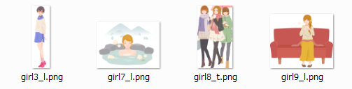
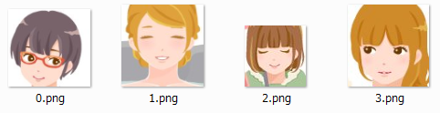
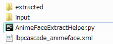
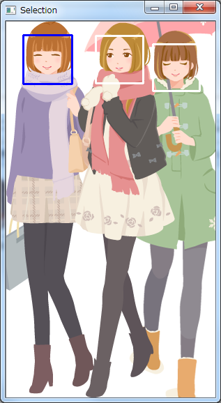
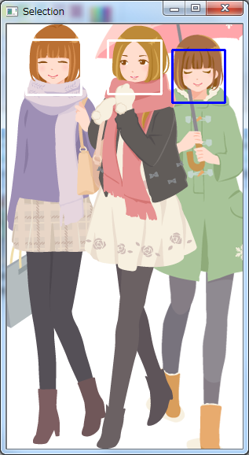
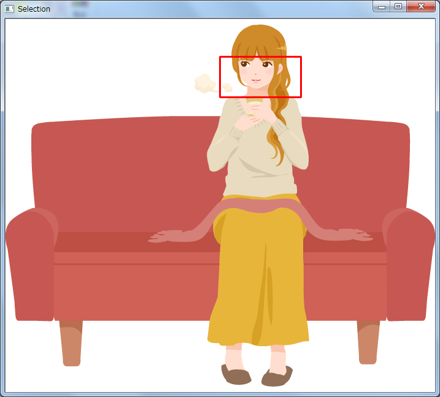
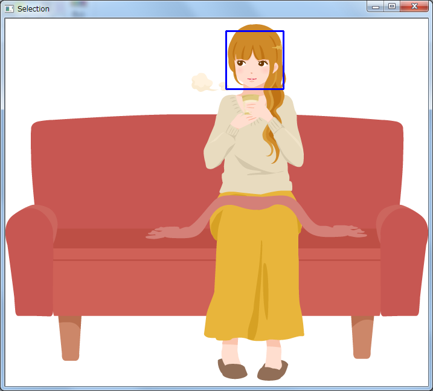

# AnimeFaceExtractHelper
A helper utility to extract anime faces.
This is meant to provide semi-auto extraction.  
Japanese explanation available at [Qiita](https://qiita.com/YankeeDeltaBravo225/items/320516deaaf5325adf24)

## Purpose:  
Extract partial images for machine learning.

### input images

### output images

## Requires:  
- Python 3 Interperter  
  Anaconda recommended  
  https://www.anaconda.com/download/  
- Open CV 3  
  `conda install --channel https://conda.anaconda.org/menpo opencv3`  
- lbpcascade_animeface  
https://github.com/nagadomi/lbpcascade_animeface  

## Usage:  
`python AnimeFaceExtractHelper.py <input directory> <output directory>`
  
## How to use:  
This program scans images from the given directory, and then classifies
candidates to extract anime faces using lbpcascade_animeface.   
Files need to be placed like the image below.  

  
When you run the program, it will classify each images by lbpcascade_animeface.  
Found anime face candidates will be shown in blue or white rectanglees.  

  
The blue one is the current selection, when you hit Enter key,  
the partial image shown in the blue rectangle will be saved.  
Or Press Esc key to skip the image if you don't like it.  
  
You can change the selection by left or right arrow key.  
Then a white rectangle will be blue, it is the currently selected area.  

  
You can also select the area by mouse.  
If the area is not a square, the rectanble will be shown in red lines.  

  
In this case, selected area is handled as invalid. Thus save will no be done.  
Then adjust the coordinate until it becomes blue.

